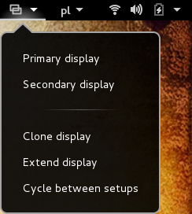
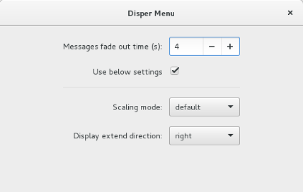

Disper Menu
===========

 

## About

Disper Menu is a GNOME Shell extension that allows you to use the on-the-fly display switcher `disper` through GNOME Shell panel.

Actions supported are: primary, secondary, clone, extend, cycle.

Disper Menu was only tested with GNOME Shell 3.14.0.

## Installation

You need to install `disper` from your Linux distribution software repository or from [disper homepage](http://willem.engen.nl/projects/disper/) in order to use this extension.

I recommend using [GNOME.org Extensions](https://extensions.gnome.org/extension/884/disper-menu/) for Disper Menu installation.

If your browser doesn't support NPAPI (e.g. Google Chrome) and you don't want to use another web browser to download GNOME Shell extensions, you can clone this repository using `git` and use the [install.sh](scripts/install.sh) script.

## Preferences
You can setup preferences using `gnome-shell-extension-prefs` or `gnome-tweak-tool`.

Available `disper` preferences are: scaling mode, extend direction.

For more `disper` preferences you should create a `disper` config file. See "FILES" section of the `disper` manual.

## Translation
Disper Menu is currently translated into English, German and Polish.

If you wish to see it in other language or have fixed any translation errors, send me a pull request with the `po` file.

You can generate the `pot` file using [create_pot.sh](scripts/create_pot.sh) script.

I recommend using [poedit](http://poedit.net/) for translations.

## Authors
Łukasz Wieczorek aka wieczorek1990

## License
See the [GNU GPL v2.0 license](LICENSE).
